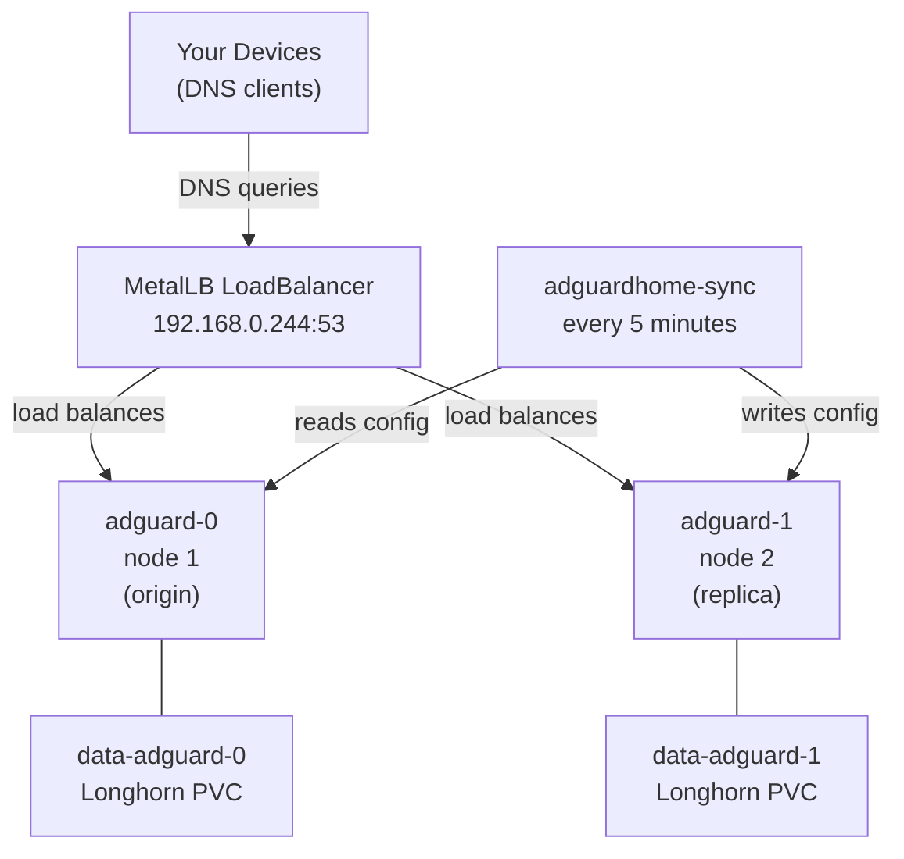

# AdGuard Home

High-availability DNS using two AdGuard Home instances with config sync.

## Architecture

## How it works

- **Two replicas** run as a StatefulSet, scheduled on separate nodes via pod anti-affinity. If one node goes down, the other continues serving DNS.
- **MetalLB** assigns a single IP (`192.168.0.244`) and distributes DNS traffic across both pods. If a pod is unhealthy, traffic is automatically routed to the other.
- **Each pod has its own PVC** (`data-adguard-0`, `data-adguard-1`) so configuration is isolated per instance.
- **adguardhome-sync** runs every 5 minutes and copies configuration from `adguard-0` (origin) to `adguard-1` (replica). It also syncs on startup.
- **Rolling updates** update `adguard-1` first, wait for it to pass health checks, then update `adguard-0` — ensuring at least one instance is always up during upgrades.

## Making config changes

Always make changes in **`adguard-0`**'s UI. They will propagate to `adguard-1` within 5 minutes.

The web UI for each instance is accessible via Traefik at the configured IngressRoute.

## Secrets

`adguardhome-sync` requires credentials for both AdGuard instances. These are stored as a SealedSecret (`adguardhome-sync-sealed-secret.yaml`).

To rotate credentials:
1. Update `adguardhome-sync-secret.yaml` with new values
2. Seal it: `kubeseal --format yaml < adguardhome-sync-secret.yaml > adguardhome-sync-sealed-secret.yaml`
3. Delete `adguardhome-sync-secret.yaml`
4. Commit `adguardhome-sync-sealed-secret.yaml`
